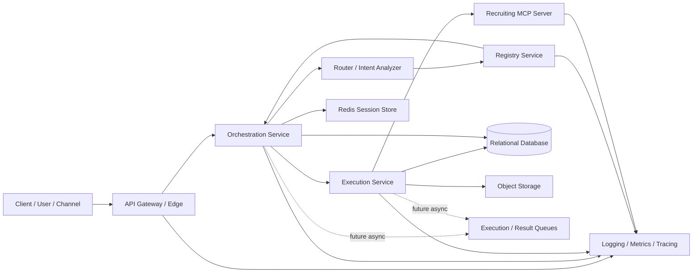
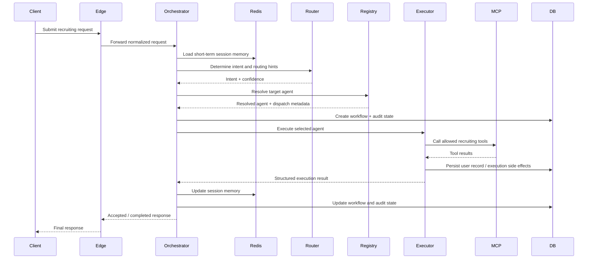
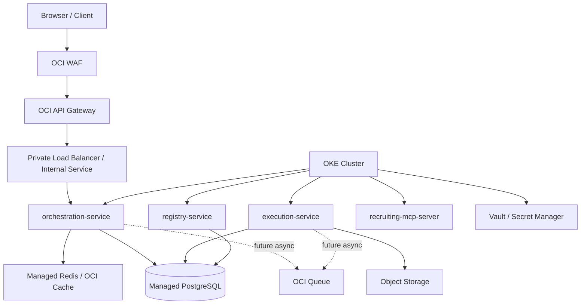

# Oracle Fusion HCM Architecture README

## Purpose

This document describes the current architecture, system design, runtime flow,
security model, persistence model, deployment topology, and production
deployment plan for the Oracle Fusion HCM recruiting multi-agent platform in
this workspace.

The repository models a production-oriented, service-based agent platform for
Fusion HCM recruiting and hiring workflows. It is not a single monolith. It is
a monorepo that builds several independently deployable services.

This README is intended for:

- architecture review
- backend engineering
- platform engineering
- SRE / DevOps
- security review
- production readiness planning

## Current Workspace Inventory

The current workspace contains the following key items:

### Core Service Modules

- `orchestration-service`
- `execution-service`
- `registry-service`
- `recruiting-mcp-server`
- `platform-common`

### Root-Level Design and Reference Documents

- `README.md`
- `multi-agent-platform-design.md`
- `multi-agent-platform-tdd.md`
- `manage-compound-fields-flow-diagram.md`
- `manage-compound-fields-redwood-technical-design.md`
- `VsCodeInstall.md`

### Deployment Assets

- `deploy/README.md`
- `deploy/helm/fusion-arch/Chart.yaml`
- `deploy/helm/fusion-arch/values.yaml`
- `deploy/helm/fusion-arch/values-dev.yaml`
- `deploy/helm/fusion-arch/values-test.yaml`
- `deploy/helm/fusion-arch/values-prod.yaml`
- `deploy/helm/fusion-arch/templates/*`

### Containerization Assets

- `orchestration-service/Dockerfile`
- `execution-service/Dockerfile`
- `registry-service/Dockerfile`
- `recruiting-mcp-server/Dockerfile`
- `.dockerignore`

### Application Entrypoints

- `src/main/java/com/recruiting/platform/RecruitingMultiAgentApplication.java`
- `orchestration-service/src/main/java/com/recruiting/platform/orchestration/OrchestrationServiceApplication.java`
- `execution-service/src/main/java/com/recruiting/platform/execution/ExecutionServiceApplication.java`
- `registry-service/src/main/java/com/recruiting/platform/registry/RegistryServiceApplication.java`
- `recruiting-mcp-server/src/main/java/com/recruiting/platform/mcp/RecruitingMcpServerApplication.java`

### Shared Contracts and DTOs

- `platform-common/src/main/java/com/recruiting/platform/common/dto/*`
- `platform-common/src/main/java/com/recruiting/platform/common/model/*`
- `platform-common/src/main/java/com/recruiting/platform/common/domain/*`
- `platform-common/src/main/java/com/recruiting/platform/common/support/*`

## System Intent

The platform accepts recruiting-related requests from a client or channel,
classifies the request intent, resolves the best agent for the request,
executes the selected agent using tool and data integrations, and persists
workflow state, audit data, and execution results.

The current implementation is specialized for recruiting use cases such as:

- candidate screening
- candidate status retrieval
- interview scheduling
- offer approval
- recruiter copilot interactions

At a high level, the system separates concerns into:

- control plane
- execution plane
- memory and persistence plane
- tool access plane
- deployment and observability plane

## Architecture Overview

## Service Boundaries

### 1. Orchestration Service

The orchestration layer is the system control plane.

Primary responsibilities:

- public API intake
- request normalization
- session and workflow correlation
- intent analysis
- agent resolution
- workflow state creation and updates
- pause and resume semantics
- audit trail persistence
- final response assembly

Current public endpoints:

- `POST /api/v1/agent-requests`
- `GET /api/v1/agent-requests/{requestId}`
- `POST /api/v1/workflows/{workflowId}/pause`
- `POST /api/v1/workflows/{workflowId}/resume`

Current request headers expected by the controller:

- `X-Tenant-Id`
- `X-Session-Id`
- `X-Request-Id` optional
- `X-User-Id` optional

The orchestration service currently performs a synchronous internal call to the
execution service after resolving the target agent.

### 2. Execution Service

The execution layer is the business execution plane.

Primary responsibilities:

- execute the resolved agent
- construct the execution context
- narrow the visible tool set
- invoke tools and downstream integrations
- persist durable user record state
- return structured execution results

Current internal endpoint:

- `POST /internal/v1/executions`

The execution service currently contains agent implementations for:

- `CandidateScreeningAgent`
- `CandidateStatusAgent`
- `InterviewSchedulingAgent`
- `OfferApprovalAgent`
- `RecruiterCopilotAgent`
- `RecruitingCopilotAssistant`

### 3. Registry Service

The registry service is the business-level agent discovery component.

Primary responsibilities:

- maintain available agent metadata
- resolve the best target agent for an intent
- support tenant-aware registry behavior
- provide dispatch metadata back to orchestration

Current internal endpoint:

- `POST /internal/v1/agent-registry/resolve`

This is not service discovery in the infrastructure sense. Kubernetes Service
DNS or a mesh handles service discovery. The registry service handles
agent-level resolution.

### 4. Recruiting MCP Server

The MCP server is the tool plane.

Primary responsibilities:

- expose recruiting-specific tools over MCP
- isolate tool execution from orchestration logic
- serve as a dedicated integration surface for recruiting data operations

Current tool families documented in the workspace:

- `candidate_tool`
- `requisition_tool`
- `job_application_tool`

### 5. Platform Common

The `platform-common` module contains shared contracts used by multiple
services:

- DTOs
- request / response model objects
- enums
- id generation helpers
- JSON support utilities

This prevents transport and contract drift across services.

## Request Lifecycle

The current request flow is synchronous between orchestration and execution.

## Control Plane Design

The control plane is centered in `orchestration-service`.

### Responsibilities

- accept requests from browser or gateway
- correlate every request with `tenant_id`, `session_id`, and `request_id`
- invoke the routing layer
- resolve the target agent from `registry-service`
- persist workflow state transitions
- coordinate pause/resume and HITL flows
- call the execution plane
- assemble response status for client polling

### Why It Exists Separately

The orchestration layer is intentionally separate from any single supervisor
agent because it provides deterministic platform behavior for:

- workflow durability
- retries
- pause and resume
- idempotency
- auditability
- operational observability
- tenant enforcement
- execution tracking

These are system responsibilities, not just reasoning responsibilities.

## Routing and Agent Resolution

Routing currently happens in two stages:

### Stage 1: Intent Analysis

The router classifies the request and infers:

- intent type
- confidence
- candidate target agent type
- routing context

This stage is implemented with LangChain4j-backed routing and can fall back to
heuristics when no model API key is present.

### Stage 2: Registry Resolution

Once intent is known, orchestration sends an internal request to the registry
service. The registry returns:

- active target agent id
- dispatch type
- dispatch metadata

This allows the platform to enroll, disable, or version agents without
hardcoding all routing decisions into the orchestrator.

## Execution Plane Design

The execution plane is designed to keep heavy business logic out of the control
plane.

### Core Responsibilities

- instantiate the resolved agent
- construct `AgentExecutionContext`
- enforce allowed-tool visibility
- run tool calls and downstream actions
- trace the execution span
- persist execution side effects

### Tool Narrowing Model

The execution service does not expose the full tool catalog to every agent.
Instead it performs:

1. target agent resolution
2. tool metadata lookup
3. capability-based filtering
4. keyword or metadata scoring
5. top-K visible tool selection
6. enforcement of that shortlist during execution

This is a very important safety and governance layer. It reduces blast radius,
prevents irrelevant tool invocation, and keeps agent prompts more bounded.

## Persistence Model

The platform uses two persistence categories:

### 1. Short-Term State

Stored in Redis.

Used for:

- conversational session memory
- short-lived workflow context
- temporary state between orchestration steps

Characteristics:

- fast access
- ephemeral
- suited for horizontal scale

### 2. Durable Relational State

Stored in a relational database.

Current local implementation:

- H2 in-memory databases for orchestration, execution, and registry flows

Production target:

- PostgreSQL or managed Oracle-compatible relational infrastructure

### Orchestration Durable Tables

The orchestration schema currently includes:

#### `workflow_execution`

Stores workflow-level lifecycle information:

- `workflow_id`
- `request_id`
- `tenant_id`
- `session_id`
- `user_id`
- `status`
- `intent`
- `target_agent_id`
- `router_confidence`
- `current_step`
- `error_code`
- `error_message`
- `result_payload`
- timestamps

#### `workflow_step_execution`

Stores step-by-step workflow progress:

- step identity
- step name
- step type
- attempt number
- input payload
- output payload
- timestamps
- error details

#### `audit_event`

Stores auditable decisions and actions:

- request id
- workflow id
- tenant id
- actor metadata
- decision summary
- result payload
- event timestamp

#### `hitl_task`

Stores human-in-the-loop state:

- workflow id
- tenant id
- task type
- status
- assignee
- approval payload
- created and resolved timestamps

### Execution Durable Tables

The execution schema currently includes:

#### `user_record_status`

Stores durable record state changes:

- `record_id`
- `tenant_id`
- `status_code`
- `status_reason`
- `updated_by`
- `updated_at`

## Security Architecture

The current codebase already distinguishes between public entry and internal
service-to-service communication.

### Current Internal Security Model

Internal calls use JWT bearer tokens with:

- issuer
- audience
- short token TTL
- service name subject

Current local-first design uses:

- HS256 shared secret signing
- per-service audience validation

Current internal security protects:

- `execution-service`
- `registry-service`
- `recruiting-mcp-server`

### Current Gap

The orchestration service controller is currently open and permissive. For a
production deployment, the orchestration edge must be protected by:

- API Gateway auth
- application-layer auth
- tenant-aware authorization
- rate limiting
- request validation

### Production Security Target

For production, the recommended model is:

- public auth at API Gateway or identity-aware ingress
- internal JWT using asymmetric signing
- JWKS-based verification where needed
- secret and key storage in Vault
- private service networking
- workload identity for OCI-integrated pods
- optional mTLS between internal services

## Deployment Architecture

The current workspace includes OCI OKE-oriented deployment assets under
`deploy/`.

### Target Deployment Topology

### Deployment Units

Each service should be deployed independently as:

- one container image
- one Kubernetes `Deployment`
- one Kubernetes `Service`
- independent autoscaling policy

Recommended separation:

- `orchestration-service`: public-facing application API
- `execution-service`: private execution worker/API
- `registry-service`: private internal registry API
- `recruiting-mcp-server`: private internal MCP endpoint

### Existing Deployment Scaffold

The current workspace already contains:

- service Dockerfiles
- Helm chart skeleton
- environment-specific values files
- PDB templates
- HPA templates
- ConfigMap and Secret templates
- optional private load balancer service for orchestration

### Helm Structure

The existing Helm chart under `deploy/helm/fusion-arch` includes templates for:

- service account
- config map
- secret
- deployment
- cluster-internal service
- orchestration private load balancer service
- HPA
- PDB

### Environment Overlays

The chart already defines:

- `values-dev.yaml`
- `values-test.yaml`
- `values-prod.yaml`

These overlays adjust:

- replica counts
- autoscaling bounds
- internal endpoint values
- tracing enablement
- private load balancer enablement

## Build and Packaging Model

The repo uses Maven multi-module packaging.

### Build Characteristics

- Java 21
- Spring Boot 3.4.x
- one jar per deployable module
- shared parent POM

### Packaging Outputs

The platform produces separate jar artifacts for:

- orchestration
- execution
- registry
- MCP server

### Container Build Model

Each service Dockerfile:

- uses a Maven + JDK build stage
- packages the relevant module
- copies the built jar into a JRE runtime image
- runs as a non-root user

This is a clean production baseline for containerized deployment.

## Current Configuration Model

Current runtime config is based on `application.yml` plus environment variables.

### Orchestration Config

Includes:

- server port
- datasource
- Redis host and port
- AI model configuration
- internal JWT signing values
- downstream service base URLs

### Execution Config

Includes:

- server port
- datasource
- AI model configuration
- internal JWT validation config
- MCP base URL
- tool selection limits

### Registry Config

Includes:

- server port
- datasource
- internal JWT validation config

### MCP Config

Includes:

- server port
- internal JWT validation config

## Current Local-First Tradeoffs

The current workspace is production-shaped but still optimized for developer
speed in a few important areas.

### Current Simplifications

- H2 in-memory databases instead of a production relational database
- shared-secret HS256 JWTs instead of asymmetric keys
- synchronous orchestration-to-execution handoff
- local sample recruiting data and tool mocks

### Why These Matter

These simplifications are fine for development, but a real production
deployment should move to:

- managed PostgreSQL or equivalent
- key rotation and asymmetric service auth
- queue-based execution handoff
- durable object storage for larger artifacts
- stronger ingress auth and tenant policy enforcement

## Recommended Production Design

The best production model for this platform is:

### Edge and Access

- browser or client -> WAF -> API Gateway -> private LB -> orchestration
- only orchestration is public
- all internal services remain private

### Service Communication

- orchestration -> registry remains request/response
- orchestration -> execution becomes async via queue
- execution -> orchestration completion becomes result event or DB state update
- execution -> MCP remains internal authenticated service call

### State and Data

- Redis for session and short-lived context
- relational DB for workflow and business state
- object storage for uploaded documents and large artifacts
- queue for long-running execution dispatch and result fan-in

### Security

- end-user auth at gateway
- service auth with JWT or mTLS
- Vault-managed secrets
- OKE workload identity
- strict tenant and role-based authorization

### Operations

- autoscaling by CPU, memory, and queue depth
- distributed tracing
- structured logs
- health and readiness probes
- alerts on workflow failures, queue lag, and high latency

## A2A and MCP Positioning

If the platform later adopts a formal A2A pattern:

- orchestration becomes the primary A2A client
- specialist execution agents become A2A servers
- registry exposes discoverable agent metadata
- MCP remains behind those agents as the tool protocol

This keeps the boundary clear:

- A2A for agent-to-agent delegation
- MCP for agent-to-tool invocation

## Production Readiness Checklist

Before a production release, the following items should be completed:

### Architecture and Runtime

- replace sync execution handoff with queue-based execution
- add idempotency keys across request lifecycle
- add reconciliation jobs for stuck workflows
- externalize large result payloads from DB row columns

### Security

- secure orchestration public API
- replace HS256 shared secrets with asymmetric JWT or mTLS
- store secrets in Vault
- enforce tenant authz for every API and workflow read

### Persistence

- replace H2 with managed relational database
- add schema migrations
- validate backup and restore strategy

### Observability

- add end-to-end correlation ids
- emit structured audit events consistently
- define SLOs for orchestration and execution latency
- add dashboards for workflow status and tool error rates

### Deployment

- finalize Helm values for each environment
- connect CI/CD to build and publish images
- implement blue/green or canary rollout
- test failover and autoscaling under load

## Suggested Reading Order in This Workspace

For a reviewer who is new to the repo, the best order is:

1. `README.md`
2. `multi-agent-platform-design.md`
3. `multi-agent-platform-tdd.md`
4. `deploy/README.md`
5. `orchestration-service/src/main/java/.../AgentRequestController.java`
6. `execution-service/src/main/java/.../ExecutionController.java`
7. `registry-service/src/main/java/.../RegistryController.java`
8. `orchestration-service/src/main/resources/schema.sql`
9. `execution-service/src/main/resources/schema.sql`

## Summary

This workspace already contains a strong production-oriented architectural
foundation:

- separated orchestration, execution, registry, and tool planes
- shared transport and model contracts
- workflow and audit persistence
- Redis-backed short-term state
- deployable OCI OKE scaffold
- independent scaling boundaries

The main work remaining for a true production rollout is not architectural
re-think. It is production hardening:

- stronger auth at the public edge
- asymmetric internal security
- managed state stores
- async execution dispatch
- operational maturity around queues, observability, and recovery

That makes the current design a good base for a production Oracle Fusion HCM
agent platform rather than just a prototype.
