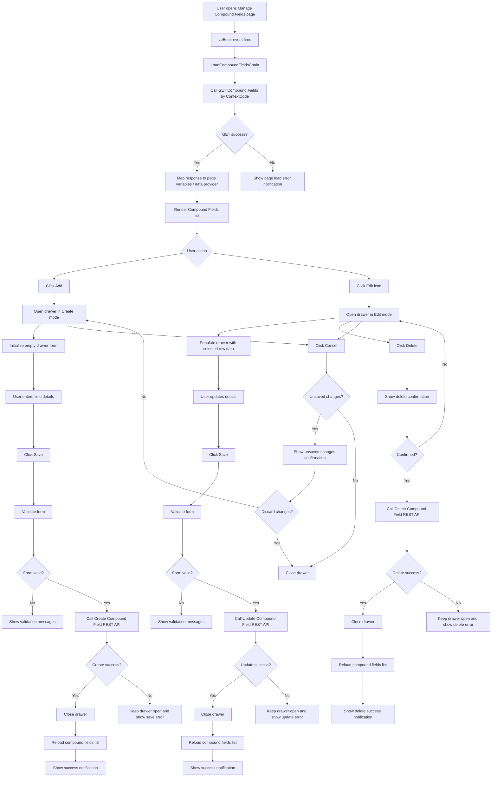

# Manage Compound Fields Flow Diagram

## Notes

- `GET` is used to load all compound fields for the supplied `ContextCode`.
- `Create` and `Delete` flows are straightforward from the supplied service contract.
- `Update` is shown as a separate save path, but the exact API contract still needs confirmation because the provided update definition is ambiguous.
