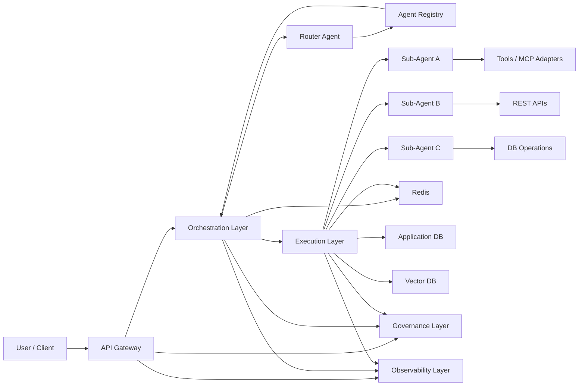
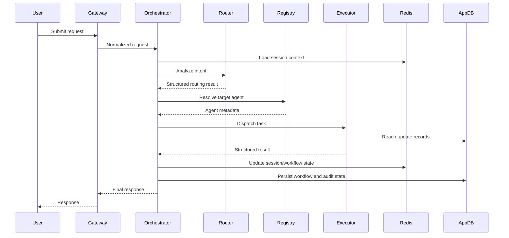

# Multi-Agent Platform Design

## Document Control

| Field | Value |
|---|---|
| Document Type | High-Level Design |
| Audience | Architecture, Platform Engineering, Backend Engineering, SRE |
| Status | Draft |
| Scope | Multi-agent hosting platform |
| Primary Goal | Route user requests to specialized agents and manage execution, state, governance, and observability |

---

## 1. Purpose

This document describes the target architecture for a production-grade multi-agent platform.

The platform must support:

- request intake from client channels
- intent-based routing
- agent discovery and dispatch
- execution of tools, REST APIs, and DB operations
- short-term and durable state handling
- observability, governance, and tenant-aware controls

---

## 2. Scope

### In Scope

- orchestration layer
- router agent / intent analyzer
- agent registry
- execution layer and sub-agents
- tool integration model
- short-term and durable state storage
- observability and governance
- multi-tenancy considerations

### Out of Scope

- UI design for end users
- detailed prompt design for each agent
- vendor-specific infra setup scripts
- model benchmarking and model selection policy
- DR / backup implementation details

---

## 3. Assumptions

| ID | Assumption |
|---|---|
| A1 | The platform will host multiple specialized agents rather than a single general-purpose agent. |
| A2 | Requests may require routing to different agents based on user intent and required capabilities. |
| A3 | Redis will be used for short-term session and workflow context. |
| A4 | A relational database will store durable business state, workflow history, audit records, and registry metadata. |
| A5 | Execution workers are stateless and can scale horizontally. |
| A6 | Every request carries tenant and session context. |
| A7 | The platform may later integrate with MCP-compliant tools or internal adapters. |
| A8 | High-risk decisions may require pause/resume or human approval support. |

---

## 4. Architecture Overview

The architecture is split into three primary layers:

| Layer | Responsibility |
|---|---|
| Orchestration Layer | Intent analysis, routing, workflow control, retries, pause/resume, and coordination |
| Execution Layer | Sub-agent execution, tool calls, REST integrations, DB operations, retrieval |
| Memory and State Layer | Short-term session context, workflow state, durable record state, audit history |

Supporting cross-cutting services:

- API Gateway
- Agent Registry
- Governance Layer
- Observability Layer

---

## 5. Block Diagram



---

## 6. Component Design

### 6.1 API Gateway

#### Responsibilities

- accept inbound requests
- authenticate and authorize callers
- extract tenant and session metadata
- apply rate limiting and request validation
- initialize request tracing

#### Inputs

| Field | Description |
|---|---|
| `request_id` | unique request identifier |
| `tenant_id` | logical tenant or customer identifier |
| `user_id` | calling user |
| `session_id` | conversation or session identifier |
| `query` | natural language user input |
| `channel` | source channel such as web, mobile, bot |

#### Outputs

- normalized request payload to orchestration layer

---

### 6.2 Orchestration Layer

#### Responsibilities

- manage workflow lifecycle
- invoke intent analysis
- query the agent registry
- choose target agent
- sequence execution steps
- manage retries, timeout, pause/resume
- persist workflow progress

#### Design Notes

- this layer owns control flow, not heavy execution
- this layer should not directly implement business-specific tool logic
- orchestration may be implemented using a durable workflow engine

#### Suggested Capabilities

| Capability | Description |
|---|---|
| Routing | Select target agent based on intent and capabilities |
| Retry Control | Control retry strategy and timeout handling |
| Pause / Resume | Support human approval or long-running waits |
| State Transition | Track workflow state changes |
| Dispatch | Forward tasks to execution workers |

---

### 6.3 Router Agent / Intent Analyzer

#### Responsibilities

- classify user intent
- identify required capabilities
- produce a structured routing response

#### Expected Output

```json
{
  "intent": "update_user_status",
  "target_agent_type": "record_management_agent",
  "confidence": 0.94,
  "required_capabilities": [
    "db_read",
    "db_update"
  ],
  "human_review_required": false
}
```

#### Design Rules

- output must be structured
- output should not contain free-form control instructions
- low-confidence outputs should trigger fallback or HITL handling

---

### 6.4 Agent Registry

#### Purpose

The agent registry stores metadata about available agents and supports semantic routing.

This is similar to service discovery, but at a higher level:

- service discovery tells the platform where a service is running
- agent registry tells the platform which agent should handle a request

#### Responsibilities

- maintain agent definitions
- map intents to agents
- support tenant-aware and version-aware routing
- expose dispatch metadata for execution

#### Suggested Registry Fields

| Field | Purpose |
|---|---|
| `agent_id` | unique agent identifier |
| `agent_name` | readable name |
| `version` | deployed version |
| `status` | active, disabled, deprecated |
| `supported_intents` | list of supported intents |
| `capabilities` | list of supported capabilities |
| `dispatch_type` | queue, workflow, HTTP, RPC |
| `dispatch_target` | queue name, workflow name, service endpoint |
| `tenant_scope` | allowed tenants |
| `priority` | routing preference |
| `cost_tier` | optional cost-based routing |
| `owner_team` | responsible engineering team |
| `input_schema` | request contract |
| `output_schema` | response contract |

#### Example Registry Record

```json
{
  "agent_id": "record_management_agent",
  "agent_name": "Record Management Agent",
  "version": "v1",
  "status": "active",
  "supported_intents": [
    "update_user_status",
    "fetch_user_status"
  ],
  "capabilities": [
    "db_read",
    "db_update",
    "audit_logging"
  ],
  "dispatch_type": "workflow",
  "dispatch_target": "record_management_workflow",
  "tenant_scope": [
    "default"
  ],
  "priority": 10
}
```

---

### 6.5 Execution Layer

#### Responsibilities

- execute the selected sub-agent
- run tool invocations
- call downstream APIs and databases
- return structured execution results

#### Design Principles

- execution workers must be stateless
- workers should scale horizontally
- side effects should be observable and auditable
- business logic should reside here, not in orchestration

#### Execution Components

| Component | Purpose |
|---|---|
| Sub-Agent Runtime | Executes agent-specific logic |
| Tool Runner | Executes tools or MCP adapters |
| API Connectors | Calls internal or external REST services |
| DB Access Layer | Reads and updates relational data |
| Retrieval Layer | Fetches semantic context from vector stores |

---

### 6.6 Sub-Agents

#### Responsibilities

Each sub-agent handles a domain-specific workload.

Examples:

- record management agent
- status tracking agent
- support response agent
- knowledge retrieval agent

#### Inputs and Outputs

| Type | Description |
|---|---|
| Input | normalized task payload with tenant and session context |
| Output | structured result, audit metadata, confidence, and escalation flags |

---

### 6.7 Tools and Integration Layer

#### Responsibilities

- provide a standard integration surface for external operations
- isolate agent logic from connector-specific details
- simplify onboarding of new tools and APIs

#### Integration Types

- REST APIs
- SQL / ORM access
- file processors
- search services
- messaging platforms
- MCP-compatible tools

#### Recommendation

Use a standard tool contract or adapter layer so agents do not implement one-off integration logic.

---

### 6.8 Memory and State Layer

This layer separates transient runtime context from durable business state.

#### A. Redis

Use Redis for short-term state:

- session context
- recent conversation turns
- active workflow state
- locks and idempotency keys
- short-lived routing cache

#### B. Application Database

Use a relational database for durable state:

- user record status
- workflow execution history
- audit records
- agent registry metadata
- tenant configuration
- approvals and HITL state

#### C. Vector Database

Use a vector store for long-term semantic knowledge:

- retrieval augmented generation
- document search
- embedding-based lookup
- enterprise knowledge context

---

## 7. Request Lifecycle

### 7.1 End-to-End Flow



### 7.2 Logical Steps

| Step | Description |
|---|---|
| 1 | User request enters through gateway |
| 2 | Request is normalized and enriched with metadata |
| 3 | Orchestrator loads short-term context from Redis |
| 4 | Router classifies intent and required capabilities |
| 5 | Orchestrator resolves the target agent from the registry |
| 6 | Execution layer runs the selected sub-agent |
| 7 | Tools / APIs / DB calls are performed |
| 8 | Short-term and durable state are updated |
| 9 | Final response is returned |

---

## 8. Data Contracts

### 8.1 Incoming Request

```json
{
  "request_id": "req_123",
  "tenant_id": "default",
  "user_id": "u1001",
  "session_id": "s456",
  "query": "Update the status of employee 1001 to approved",
  "channel": "web"
}
```

### 8.2 Router Output

```json
{
  "intent": "update_user_status",
  "target_agent_type": "record_management_agent",
  "confidence": 0.95,
  "required_capabilities": [
    "db_read",
    "db_update"
  ],
  "human_review_required": false
}
```

### 8.3 Execution Result

```json
{
  "status": "success",
  "agent_id": "record_management_agent",
  "action_taken": "user_status_updated",
  "record_id": "1001",
  "new_status": "approved",
  "audit_ref": "aud_8989"
}
```

---

## 9. Governance Design

### Objectives

- prevent unsafe or uncontrolled execution
- enforce tenant-level limits
- validate outputs before side effects
- maintain full auditability

### Governance Controls

| Control | Purpose |
|---|---|
| Circuit Breakers | stop retry storms and failing dependency loops |
| Schema Validation | reject malformed agent outputs |
| Human-in-the-Loop | require approval for high-risk decisions |
| Policy Guardrails | apply semantic or compliance checks |
| Quotas | enforce tenant-level token, cost, or concurrency limits |
| Audit Logging | persist decisions, actions, and context |

### Audit Fields

- `request_id`
- `tenant_id`
- `agent_id`
- `timestamp`
- `input_context`
- `routing_decision`
- `tool_calls`
- `result_status`

---

## 10. Observability Design

### Objectives

- provide end-to-end traceability
- support debugging and RCA
- enable latency and failure monitoring

### Required Signals

| Signal | Description |
|---|---|
| Traces | end-to-end request and workflow tracing |
| Metrics | latency, throughput, retries, queue depth, errors |
| Structured Logs | business and technical event logging |

### Data to Capture

- request id
- session id
- tenant id
- workflow id
- agent id
- routing decision
- tool inputs and outputs
- retries and failures
- confidence values
- escalation events

---

## 11. Multi-Tenancy Model

### Tenant Requirements

- every request must include `tenant_id`
- all durable records must preserve tenant context
- quotas and throttling must be tenant aware
- traces and logs must include tenant metadata

### Isolation Options

| Isolation Type | When to Use |
|---|---|
| Logical Isolation | default multi-tenant deployments |
| Namespace Isolation | medium-trust workload separation |
| Dedicated Node Pools | sensitive or high-priority agent workloads |
| Separate Schema / DB | regulated or high-compliance environments |
| Separate Cluster | strongest operational isolation |

---

## 12. Deployment Considerations

### Recommended Runtime Model

| Runtime Element | Role |
|---|---|
| API Gateway | ingress and request controls |
| Orchestrator | workflow control and routing |
| Worker Pods | execution and tool invocation |
| Redis | transient runtime state |
| Postgres / RDBMS | durable state and registry |
| Vector DB | semantic retrieval memory |

### Scalability Strategy

- scale orchestrator by workflow load
- scale workers by queue depth or event rate
- scale Redis for active session pressure
- scale database for transactional and audit load

---

## 13. Non-Functional Requirements

| Category | Requirement |
|---|---|
| Reliability | workflows must survive worker restarts |
| Scalability | workers must scale horizontally |
| Security | tenant isolation and audited access required |
| Observability | full request traceability required |
| Extensibility | new agents must be onboarded through registry metadata |
| Maintainability | agent discovery and routing must be centralized |
| Compliance | high-risk actions must support audit and approval |

---

## 14. Risks and Design Notes

| Risk | Design Consideration |
|---|---|
| Router misclassification | use structured output, confidence thresholds, fallback rules |
| Tool sprawl | standardize adapters and tool contracts |
| Noisy neighbor impact | enforce tenant-aware quotas and isolation controls |
| Hidden execution failures | require trace-based observability |
| Tight coupling between routing and execution | keep control-plane and execution-plane responsibilities separate |
| Unbounded LLM output | validate all structured outputs before action |

---

## 15. Summary

This platform design supports scalable multi-agent execution by separating routing, execution, and state management into clear layers.

The most important architectural decisions are:

- use a dedicated orchestration layer for workflow control
- use a router agent for structured intent analysis
- use an agent registry for semantic agent discovery
- keep execution workers stateless
- use Redis for short-term session and workflow state
- use a relational database for durable records and audit history
- make governance and observability first-class parts of the platform

The `agent_registry` is a key control-point component in this architecture. It allows the platform to route requests based on capabilities and intent rather than hardcoded service paths, which makes the system easier to scale, version, and govern.
