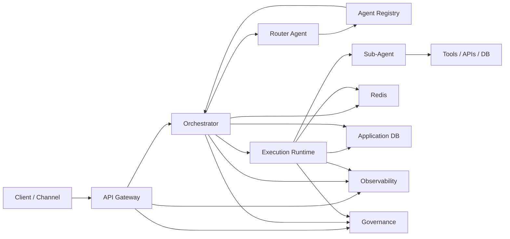
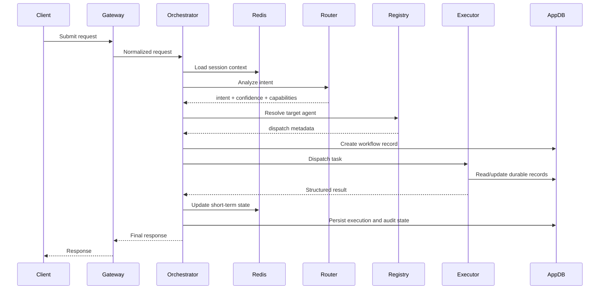
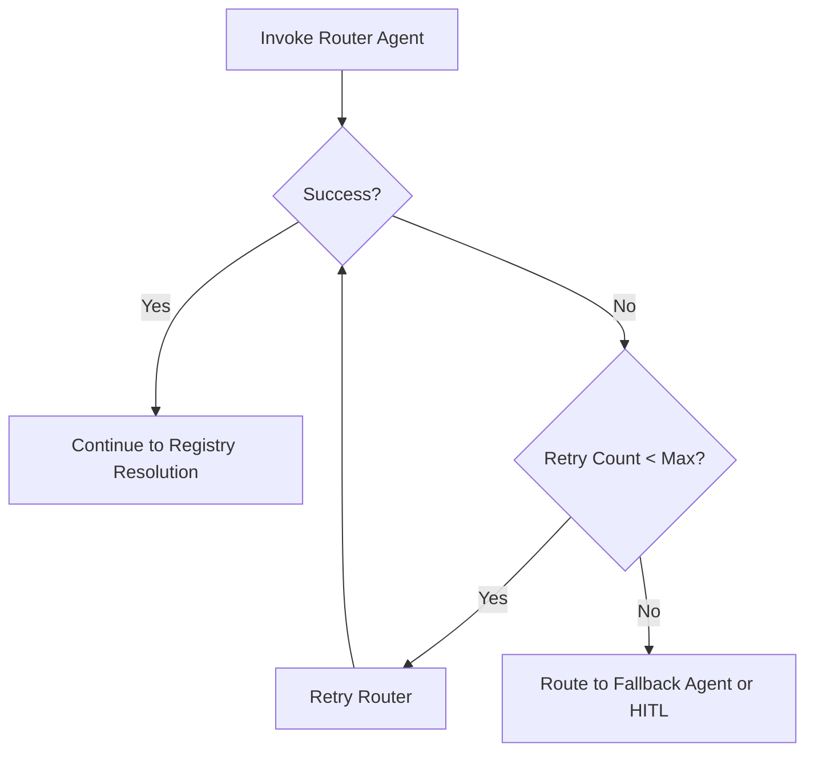
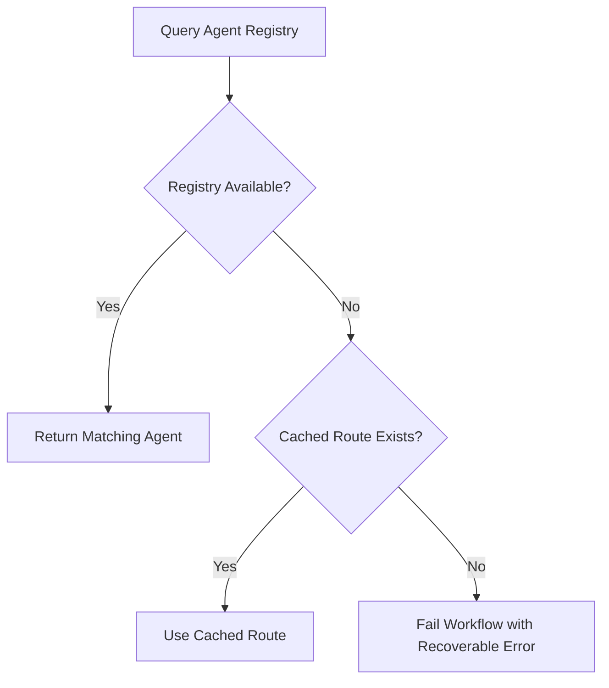
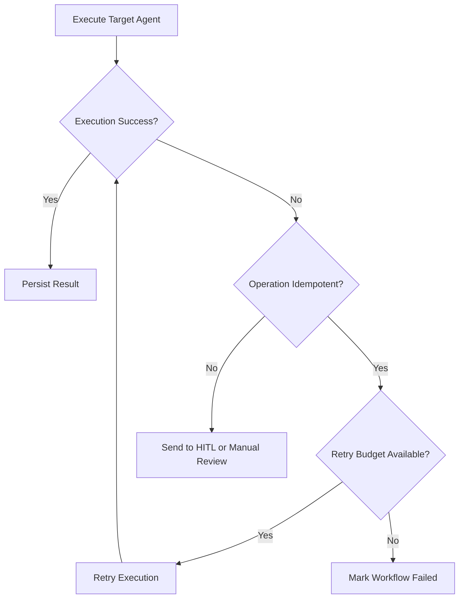
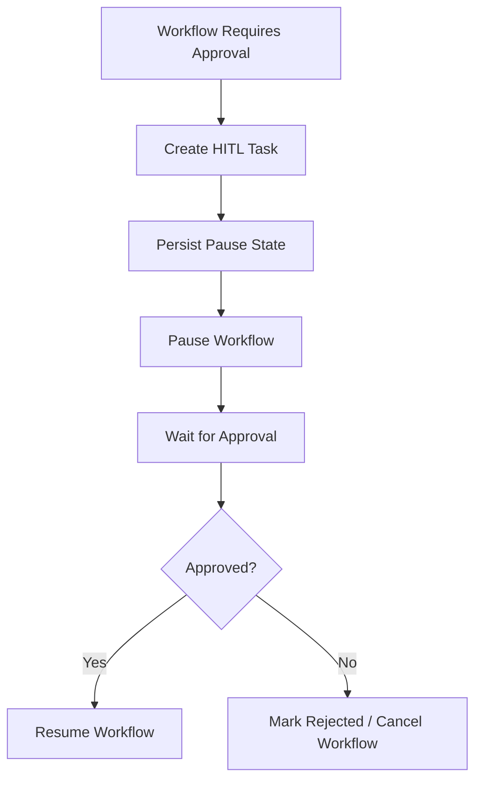

# Multi-Agent Platform Technical Design Document

## Document Control

| Field | Value |
|---|---|
| Document Type | Technical Design Document |
| Audience | Backend Engineering, Platform Engineering, SRE, Architecture |
| Status | Draft |
| Related Document | `multi-agent-platform-design.md` |
| Scope | Formal technical design for orchestration, registry, execution, state, and governance |

---

## 1. Purpose

This document defines the technical design for a production-grade multi-agent platform that accepts user requests, performs intent-based routing, dispatches work to specialized agents, manages state across Redis and a relational database, and provides governance and observability.

This TDD extends the high-level design with:

- API definitions
- database table schemas
- Redis key design
- routing and dispatch logic
- failure handling flows

---

## 2. Goals

- support intent-driven routing to specialized agents
- centralize agent discovery in an `agent_registry`
- keep orchestration and execution concerns separate
- use Redis for short-term session and workflow state
- use a relational DB for durable business state and audit records
- support retry-safe execution and observability

---

## 3. Non-Goals

- end-user UI design
- prompt authoring per agent
- vendor-specific infrastructure automation
- model evaluation policy
- detailed DR strategy

---

## 4. System Context



---

## 5. Architecture Components

### 5.1 API Gateway

Responsibilities:

- receive inbound requests
- authenticate and authorize callers
- enrich request with `request_id`, `tenant_id`, `session_id`, and user context
- apply rate limiting and request validation
- pass normalized payload to the orchestrator

### 5.2 Orchestrator

Responsibilities:

- load session and workflow context
- invoke router agent
- query `agent_registry`
- resolve the target agent
- create workflow records
- dispatch execution
- handle retries, timeout, HITL pause/resume, and final response assembly

### 5.3 Router Agent

Responsibilities:

- classify intent
- infer required capabilities
- return structured routing output

### 5.4 Agent Registry

Responsibilities:

- store metadata for all deployable agents
- support semantic discovery by intent and capability
- expose dispatch targets and version metadata
- support tenant-aware routing

### 5.5 Execution Runtime

Responsibilities:

- run the selected sub-agent
- invoke tools, external APIs, DB operations, or retrieval steps
- return structured results
- emit telemetry and audit metadata

### 5.6 Memory and State Layer

Components:

- Redis for short-term state
- relational DB for durable state
- optional vector DB for retrieval memory

---

## 6. Request Lifecycle



---

## 7. API Definitions

### 7.1 Submit Request

**Endpoint**

```http
POST /api/v1/agent-requests
```

**Headers**

| Header | Required | Description |
|---|---|---|
| `Authorization` | Yes | caller identity |
| `X-Tenant-Id` | Yes | tenant context |
| `X-Session-Id` | Yes | client session id |
| `X-Request-Id` | No | client-provided request id; generated if absent |

**Request Body**

```json
{
  "query": "Update the status of employee 1001 to approved",
  "channel": "web",
  "metadata": {
    "locale": "en-US"
  }
}
```

**Response**

```json
{
  "request_id": "req_01JTZ5Q2D5",
  "workflow_id": "wf_01JTZ5Q2KH",
  "status": "accepted"
}
```

### 7.2 Get Request Status

**Endpoint**

```http
GET /api/v1/agent-requests/{request_id}
```

**Response**

```json
{
  "request_id": "req_01JTZ5Q2D5",
  "workflow_id": "wf_01JTZ5Q2KH",
  "status": "completed",
  "target_agent_id": "record_management_agent",
  "result": {
    "action_taken": "user_status_updated",
    "record_id": "1001",
    "new_status": "approved"
  }
}
```

### 7.3 Pause Workflow for HITL

**Endpoint**

```http
POST /api/v1/workflows/{workflow_id}/pause
```

**Request Body**

```json
{
  "reason": "manager_approval_required"
}
```

### 7.4 Resume Workflow

**Endpoint**

```http
POST /api/v1/workflows/{workflow_id}/resume
```

**Request Body**

```json
{
  "approved": true,
  "approved_by": "mgr_100"
}
```

### 7.5 Registry Lookup API

This endpoint is optional if the orchestrator reads directly from DB.

**Endpoint**

```http
POST /internal/v1/agent-registry/resolve
```

**Request Body**

```json
{
  "tenant_id": "default",
  "intent": "update_user_status",
  "required_capabilities": [
    "db_read",
    "db_update"
  ]
}
```

**Response**

```json
{
  "agent_id": "record_management_agent",
  "version": "v1",
  "dispatch_type": "workflow",
  "dispatch_target": "record_management_workflow",
  "priority": 10
}
```

---

## 8. Data Contracts

### 8.1 Normalized Request

```json
{
  "request_id": "req_01JTZ5Q2D5",
  "tenant_id": "default",
  "session_id": "sess_1001",
  "user_id": "u1001",
  "query": "Update the status of employee 1001 to approved",
  "channel": "web",
  "metadata": {
    "locale": "en-US"
  }
}
```

### 8.2 Router Output

```json
{
  "intent": "update_user_status",
  "target_agent_type": "record_management_agent",
  "confidence": 0.95,
  "required_capabilities": [
    "db_read",
    "db_update"
  ],
  "human_review_required": false
}
```

### 8.3 Execution Result

```json
{
  "status": "success",
  "agent_id": "record_management_agent",
  "workflow_id": "wf_01JTZ5Q2KH",
  "action_taken": "user_status_updated",
  "record_id": "1001",
  "new_status": "approved",
  "audit_ref": "aud_01JTZ5R4XT"
}
```

---

## 9. Relational Database Schema

### 9.1 `agent_registry`

```sql
CREATE TABLE agent_registry (
  agent_id              VARCHAR(100) PRIMARY KEY,
  agent_name            VARCHAR(200) NOT NULL,
  version               VARCHAR(40) NOT NULL,
  status                VARCHAR(30) NOT NULL,
  supported_intents     JSONB NOT NULL,
  capabilities          JSONB NOT NULL,
  dispatch_type         VARCHAR(30) NOT NULL,
  dispatch_target       VARCHAR(255) NOT NULL,
  tenant_scope          JSONB NOT NULL,
  priority              INTEGER NOT NULL DEFAULT 0,
  cost_tier             VARCHAR(30),
  owner_team            VARCHAR(100),
  input_schema          JSONB,
  output_schema         JSONB,
  health_status         VARCHAR(30) DEFAULT 'unknown',
  created_at            TIMESTAMP NOT NULL DEFAULT CURRENT_TIMESTAMP,
  updated_at            TIMESTAMP NOT NULL DEFAULT CURRENT_TIMESTAMP
);
```

### 9.2 `workflow_execution`

```sql
CREATE TABLE workflow_execution (
  workflow_id           VARCHAR(100) PRIMARY KEY,
  request_id            VARCHAR(100) NOT NULL,
  tenant_id             VARCHAR(100) NOT NULL,
  session_id            VARCHAR(100) NOT NULL,
  user_id               VARCHAR(100),
  status                VARCHAR(30) NOT NULL,
  intent                VARCHAR(100),
  target_agent_id       VARCHAR(100),
  router_confidence     NUMERIC(5,4),
  current_step          VARCHAR(100),
  error_code            VARCHAR(100),
  error_message         TEXT,
  started_at            TIMESTAMP NOT NULL DEFAULT CURRENT_TIMESTAMP,
  completed_at          TIMESTAMP,
  updated_at            TIMESTAMP NOT NULL DEFAULT CURRENT_TIMESTAMP
);
```

### 9.3 `workflow_step_execution`

```sql
CREATE TABLE workflow_step_execution (
  step_execution_id     VARCHAR(100) PRIMARY KEY,
  workflow_id           VARCHAR(100) NOT NULL,
  step_name             VARCHAR(100) NOT NULL,
  step_type             VARCHAR(50) NOT NULL,
  status                VARCHAR(30) NOT NULL,
  attempt_no            INTEGER NOT NULL DEFAULT 1,
  input_payload         JSONB,
  output_payload        JSONB,
  started_at            TIMESTAMP NOT NULL DEFAULT CURRENT_TIMESTAMP,
  completed_at          TIMESTAMP,
  error_code            VARCHAR(100),
  error_message         TEXT
);
```

### 9.4 `audit_event`

```sql
CREATE TABLE audit_event (
  audit_event_id        VARCHAR(100) PRIMARY KEY,
  request_id            VARCHAR(100) NOT NULL,
  workflow_id           VARCHAR(100) NOT NULL,
  tenant_id             VARCHAR(100) NOT NULL,
  agent_id              VARCHAR(100),
  event_type            VARCHAR(100) NOT NULL,
  event_timestamp       TIMESTAMP NOT NULL DEFAULT CURRENT_TIMESTAMP,
  actor_type            VARCHAR(30) NOT NULL,
  actor_id              VARCHAR(100),
  input_context         JSONB,
  decision_summary      JSONB,
  result_payload        JSONB
);
```

### 9.5 `user_record_status`

```sql
CREATE TABLE user_record_status (
  record_id             VARCHAR(100) PRIMARY KEY,
  tenant_id             VARCHAR(100) NOT NULL,
  status_code           VARCHAR(50) NOT NULL,
  status_reason         VARCHAR(255),
  updated_by            VARCHAR(100),
  updated_at            TIMESTAMP NOT NULL DEFAULT CURRENT_TIMESTAMP
);
```

### 9.6 `hitl_task`

```sql
CREATE TABLE hitl_task (
  hitl_task_id          VARCHAR(100) PRIMARY KEY,
  workflow_id           VARCHAR(100) NOT NULL,
  tenant_id             VARCHAR(100) NOT NULL,
  task_type             VARCHAR(100) NOT NULL,
  status                VARCHAR(30) NOT NULL,
  assigned_to           VARCHAR(100),
  approval_payload      JSONB,
  created_at            TIMESTAMP NOT NULL DEFAULT CURRENT_TIMESTAMP,
  resolved_at           TIMESTAMP
);
```

---

## 10. Redis Key Design

### 10.1 Key Patterns

| Key Pattern | Type | TTL | Purpose |
|---|---|---|---|
| `session:{tenant_id}:{session_id}` | Hash / JSON | 24h | active session context |
| `workflow:{workflow_id}` | Hash / JSON | 24h | live workflow state |
| `request:{request_id}:result` | JSON | 24h | cached response payload |
| `router-cache:{tenant_id}:{intent}` | JSON | 15m | cached routing resolution |
| `lock:workflow:{workflow_id}` | String | 5m | workflow execution lock |
| `idempotency:{tenant_id}:{request_hash}` | String | 24h | request deduplication |
| `hitl:{workflow_id}` | Hash / JSON | 7d | waiting approval context |

### 10.2 Example Session Payload

```json
{
  "tenant_id": "default",
  "session_id": "sess_1001",
  "last_intent": "update_user_status",
  "recent_turns": [
    "Update employee 1001 to approved"
  ],
  "active_workflow_id": "wf_01JTZ5Q2KH"
}
```

### 10.3 Redis Design Notes

- Redis stores transient state only
- durable truth remains in the relational DB
- all keys should include tenant context where applicable
- lock keys should be short-lived and refreshed only by the active worker

---

## 11. Routing Logic

### 11.1 Routing Decision Rules

The orchestrator resolves `target_agent_id` using:

1. router output intent
2. required capabilities
3. tenant scope
4. active registry status
5. priority
6. optional cost or health rules

### 11.2 Sample Registry Resolution Query

```sql
SELECT agent_id,
       version,
       dispatch_type,
       dispatch_target,
       priority
FROM agent_registry
WHERE status = 'active'
  AND tenant_scope @> to_jsonb(ARRAY['default']::text[])
  AND supported_intents @> to_jsonb(ARRAY['update_user_status']::text[])
ORDER BY priority DESC, updated_at DESC
LIMIT 1;
```

### 11.3 Sample Routing Pseudocode

```javascript
async function resolveTargetAgent(normalizedRequest, routerOutput) {
  if (routerOutput.human_review_required) {
    return { route: 'hitl_queue' };
  }

  if (routerOutput.confidence < 0.70) {
    return { route: 'fallback_agent' };
  }

  const candidates = await agentRegistry.findActiveAgents({
    tenantId: normalizedRequest.tenant_id,
    intent: routerOutput.intent,
    capabilities: routerOutput.required_capabilities
  });

  if (!candidates.length) {
    return { route: 'default_support_agent' };
  }

  const healthyCandidates = candidates.filter(a => a.health_status !== 'down');

  return healthyCandidates.sort((a, b) => b.priority - a.priority)[0];
}
```

### 11.4 Dispatch Rules

| Dispatch Type | Behavior |
|---|---|
| `workflow` | invoke named workflow in orchestration engine |
| `queue` | publish task to worker queue |
| `http` | call internal agent endpoint |
| `rpc` | invoke internal runtime procedure |

---

## 12. Failure Handling Flows

### 12.1 Failure Categories

| Category | Example | Handling Strategy |
|---|---|---|
| Router Failure | LLM timeout | retry with bounded attempts, then fallback |
| Registry Failure | DB unavailable | use cached route if valid, else fail closed |
| No Agent Match | no active candidate | route to fallback agent or HITL |
| Execution Failure | tool/API timeout | retry if idempotent, else mark failed |
| Validation Failure | malformed agent output | reject and raise governance event |
| Persistence Failure | DB write error | retry and keep workflow in recoverable state |
| Low Confidence | router score below threshold | escalate to fallback or HITL |

### 12.2 Router Failure Flow



### 12.3 Registry Resolution Failure Flow



### 12.4 Execution Failure Flow



### 12.5 HITL Pause / Resume Flow



### 12.6 Recovery Principles

- retries must be bounded
- only idempotent steps should auto-retry
- persistent workflow state must be written before acknowledging completion
- circuit breakers should stop repeated failures against unstable dependencies

---

## 13. Governance and Validation

### 13.1 Structured Output Rules

- router output must conform to schema
- execution output must conform to schema
- free-form LLM output must not be used directly for side-effecting operations

### 13.2 Example Router Schema

```json
{
  "type": "object",
  "required": ["intent", "confidence", "required_capabilities", "human_review_required"],
  "properties": {
    "intent": { "type": "string" },
    "target_agent_type": { "type": "string" },
    "confidence": { "type": "number" },
    "required_capabilities": {
      "type": "array",
      "items": { "type": "string" }
    },
    "human_review_required": { "type": "boolean" }
  }
}
```

### 13.3 Audit Requirements

Every routing and execution decision should record:

- `request_id`
- `workflow_id`
- `tenant_id`
- `agent_id`
- event type
- timestamp
- decision summary
- relevant input and result payload

---

## 14. Observability

### 14.1 Trace Attributes

Required trace attributes:

- `request_id`
- `workflow_id`
- `tenant_id`
- `session_id`
- `agent_id`
- `intent`
- `dispatch_type`
- `step_name`
- `retry_count`
- `result_status`

### 14.2 Metrics

Recommended metrics:

- request throughput
- route resolution latency
- execution latency per agent
- error count by failure category
- retries by workflow step
- HITL queue depth
- Redis hit/miss rate

---

## 15. Security and Multi-Tenancy

- every API request must include tenant context
- every durable record must preserve tenant metadata
- routing must enforce tenant scope from `agent_registry`
- sensitive tenants may use stronger runtime isolation if required
- audit events must be immutable or append-only

---

## 16. Open Questions

1. Will registry resolution be a direct DB read or a dedicated internal service?
2. Which workflow engine will back orchestration?
3. What confidence threshold should trigger fallback or HITL?
4. Which operations are safe for automatic retry?
5. Will vector retrieval be part of all agents or only knowledge-focused agents?

---

## 17. Summary

This TDD formalizes the multi-agent platform design by defining:

- inbound APIs for request handling and workflow lifecycle
- relational schemas for agent discovery, workflow state, audit, and business state
- Redis key patterns for short-term session and execution state
- structured routing logic using `agent_registry`
- failure-handling flows for router, registry, execution, and HITL scenarios

The key technical principle is that routing decisions remain centralized in the orchestrator and registry, while side-effecting operations are delegated to stateless execution workers.
